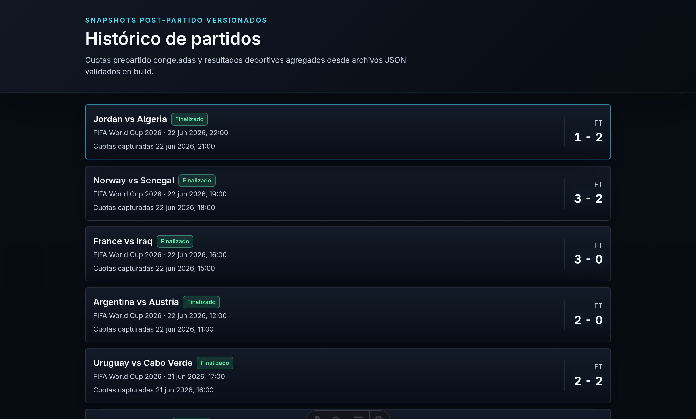
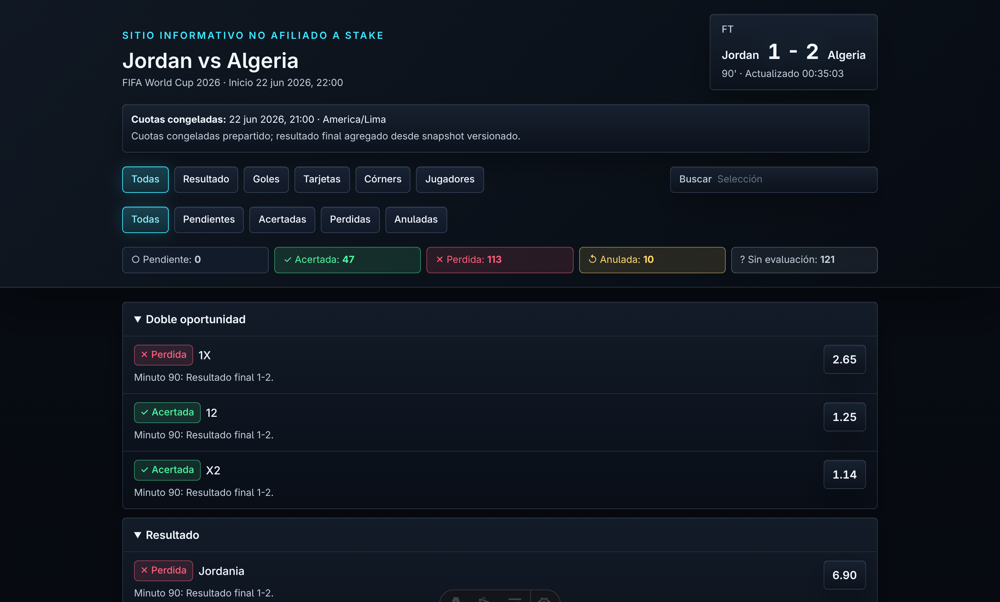
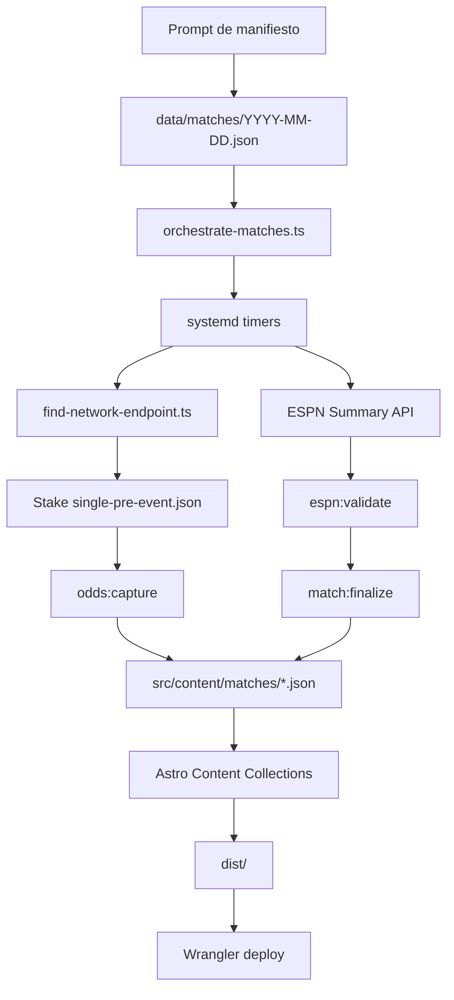

<h1 align="center">Salió</h1>

<p align="center">
  <strong>Pipeline para congelar cuotas prepartido, finalizar resultados oficiales y publicar snapshots deportivos en una web estática.</strong>
</p>

<p align="center">
  
  
  
  
  
  
  
</p>

<p align="center">
  <a href="#-resumen">Resumen</a> ·
  <a href="#-demo-visual">Demo</a> ·
  <a href="#-qué-demuestra">Qué demuestra</a> ·
  <a href="#-orquestación-local">Orquestación</a> ·
  <a href="#-cómo-correrlo">Cómo correrlo</a> ·
  <a href="#-calidad-y-seguridad">Calidad</a>
</p>

---

## 🧭 Resumen

**Salió** es un proyecto de automatización para capturar cuotas deportivas antes
de un partido, esperar el resultado oficial y publicar una web estática con qué
selecciones salieron, fallaron, se anularon o quedaron sin evaluación segura.

No es una casa de apuestas, no recomienda picks y no procesa dinero. Es un
proyecto de ingeniería práctica: integra fuentes externas inestables, valida
datos con contratos fuertes, automatiza tareas locales y entrega el resultado
como HTML estático desplegable con Wrangler.

El resultado público vive en:

```text
src/content/matches/*.json
```

Cada archivo es un snapshot versionado con cuotas congeladas y, si el partido ya
terminó, resolución postpartido.

## 🖼️ Demo Visual

<p align="center">
  
</p>

<p align="center"><strong>Histórico estático</strong></p>

<p align="center">
  
</p>

<p align="center"><strong>Detalle con filtros y resolución</strong></p>

## 📌 Estado Actual

| Área                     | Estado                                                       |
| ------------------------ | ------------------------------------------------------------ |
| Web pública              | Estática, prerenderizada con Astro.                          |
| Fuente de datos          | `src/content/matches/*.json`.                                |
| Snapshots versionados    | 38 archivos de partido al momento de esta actualización.     |
| Captura prepartido       | API-only contra endpoint interno explícito de Stake.         |
| Finalización postpartido | ESPN Summary API + reglas locales de mercado.                |
| Orquestación             | `scripts/orchestrate-matches.ts` + timers `systemd --user`.  |
| Persistencia             | JSON versionado; no se usa base de datos.                    |
| Backend en producción    | No hay SSR, API routes, panel admin ni funciones serverless. |
| Deploy                   | `dist/` publicado con Wrangler como assets estáticos.        |

## 🧪 Qué Demuestra

- Automatización end-to-end: manifiesto diario, discovery del endpoint de
  Stake, captura prepartido, watcher de resultado, finalización y deploy
  estático.
- Orquestación realista en VPS: `systemd-run --user`, timers persistentes,
  resolución de `pnpm`, perfiles aislados por partido y ejecución headless con
  `xvfb-run`.
- Diseño defensivo para integraciones incómodas: timeouts, reintentos,
  allowlists, Zod, hashes SHA-256, límites de tamaño y redacción de tokens.
- Captura API-only: el script final no scrapea DOM para cuotas; recibe una URL
  interna explícita, la valida y la usa sin reconstruirla.
- Snapshots auditables: cuotas, IDs de mercado, IDs de selección y stake quedan
  congelados antes del partido y no se reescriben al finalizar.
- UI estática con interacción puntual: Astro genera HTML y React solo maneja
  filtros, búsqueda y conteos en el navegador.
- Criterio de simplicidad: no DB si JSON alcanza, no servidor si `dist/`
  alcanza, no background jobs cloud si un VPS con timers alcanza.
- Flujo impulsado con IA: el prompt operativo embebido en este README ayuda a producir manifiestos diarios, pero el código valida y ejecuta solo datos con contrato.

Aunque el stack principal es TypeScript, el problema es típico de
automatización: navegar servicios externos, capturar evidencia, normalizar
datos, programar tareas y dejar un resultado reproducible.

## 🧑‍💻 Producto o Flujo Para Usuario

1. El usuario abre el histórico de partidos.
2. Entra a un partido.
3. Ve cuándo se congelaron las cuotas.
4. Revisa marcador, estado y mercados evaluados.
5. Filtra por categoría, estado o texto.

El valor está en la trazabilidad: **qué estaba disponible antes del partido y
qué ocurrió después**.

## 🧾 Prompt Para Manifiestos Diarios

El flujo diario parte de un manifiesto local en:

```text
data/matches/YYYY-MM-DD.json
```

Ese archivo no se versiona porque puede contener datos operativos o URLs
transitorias. El prompt operativo para generar ese manifiesto queda embebido
abajo para que el proceso sea revisable desde GitHub.

Contrato esperado, en términos prácticos:

| Campo         | Uso                                                      |
| ------------- | -------------------------------------------------------- |
| `slug`        | Nombre estable del snapshot y ruta pública.              |
| `title`       | Título visible del partido.                              |
| `stakeUrl`    | Página pública usada para descubrir el endpoint interno. |
| `espnEventId` | ID usado para validar/finalizar resultado oficial.       |
| `kickoff`     | Hora UTC del inicio.                                     |
| `competition` | Competición visible en la web.                           |
| `timezone`    | Zona horaria de lectura, normalmente `America/Lima`.     |

<details>
<summary>Ver prompt completo usado para generar manifiestos</summary>

````text
## Parámetro de 2026-06-24
ZONA_HORARIA=America/Lima
```

Antes de comenzar, sustituye `YYYY-MM-DD` por la fecha que deseo consultar.

Ejemplo2026-06-24
ZONA_HORARIA=America/Lima
```

Necesito que generes un manifiesto de descubrimiento para **todos los partidos de la FIFA World Cup 2026 correspondientes a `FECHA_OBJETIVO`**, considerando el día completo según la zona horaria `America/Lima`.

No interpretes la fecha como “hoy”, “mañana” ni “ayer”. Usa exactamente la fecha absoluta proporcionada en `FECHA_OBJETIVO`.

Debes investigar los partidos de esa fecha, obtener sus fuentes oficiales, encontrar sus páginas individuales de ESPN o ESPN Deportes y localizar URLs funcionales de Stake Perú para cada encuentro.

Utiliza navegación web actual, búsquedas indexadas específicas y, cuando sea útil, respuestas JSON/GraphQL, código público reciente, HTML, archivos HAR o URLs de otras versiones regionales de Stake.

La prioridad es **no omitir partidos válidos de la fecha objetivo**.

No inventes horarios, equipos, sedes, IDs de ESPN ni IDs de FIFA. Para Stake, puedes encontrar, adaptar o construir URLs candidatas siguiendo las reglas flexibles de este prompt y validarlas principalmente comprobando si cargan.

---

# Entrega

La respuesta debe contener dos partes.

## 1. Informe breve

Incluye un informe de entre 3 y 8 líneas indicando:

* Fecha objetivo en `America/Lima`.
* Número total de partidos encontrados.
* Número de URLs funcionales de Stake encontradas.
* Número de páginas de ESPN encontradas.
* Número de partidos que requieren revisión.
* Limitaciones importantes, si existen.

## 2. Archivo JSON

Crea un archivo llamado:

```text
FECHA_OBJETIVO.json
```

Sustituye `FECHA_OBJETIVO` por la fecha real en formato `YYYY-MM-DD`.

Ejemplo:

```text
2026-06-24.json
```

Proporciona un enlace descargable al archivo.

Si no puedes crear archivos, entrega el manifiesto completo dentro de un bloque Markdown:

```json
{
  "schema_version": "match-discovery-manifest.v2"
}
```

El archivo o bloque debe contener JSON válido:

* Sin comentarios.
* Sin Markdown dentro del JSON.
* Sin comas finales.
* Sin texto explicativo dentro del objeto.
* Sin citas insertadas en los valores.
* Sin propiedades omitidas.
* Sin valores de ejemplo sin reemplazar.

El informe breve debe estar fuera del archivo o bloque JSON.

---

# Estructura general del manifiesto

```json
{
  "schema_version": "match-discovery-manifest.v2",
  "generated_at": "string",
  "generated_for": {
    "local_date": "string",
    "timezone": "America/Lima"
  },
  "search_window": {
    "from_utc": "string",
    "to_utc": "string"
  },
  "competition": {
    "id": "fifa-world-cup-2026",
    "name": "FIFA World Cup 2026",
    "season": "2026"
  },
  "matches": [],
  "rejected_candidates": [],
  "summary": {
    "matches_discovered": 0,
    "matches_ready_for_endpoint_discovery": 0,
    "matches_requiring_review": 0,
    "stake_pages_found": 0,
    "espn_pages_found": 0
  }
}
```

---

# 1. Fecha objetivo y ventana temporal

1. Lee la fecha absoluta proporcionada en:

```text
FECHA_OBJETIVO=YYYY-MM-DD
```

2. Valida que tenga formato `YYYY-MM-DD`.
3. Usa exactamente esa fecha en:

```json
"generated_for": {
  "local_date": "YYYY-MM-DD",
  "timezone": "America/Lima"
}
```

4. No sustituyas la fecha por la fecha actual.
5. No sumes ni restes días.
6. No interpretes expresiones relativas.
7. `generated_at` debe contener el momento real de generación en UTC, en formato ISO 8601 y terminado en `Z`.
8. Calcula la ventana UTC correspondiente al día completo de `FECHA_OBJETIVO` en Lima:

   * `from_utc`: `00:00:00` de la fecha objetivo en `America/Lima`, convertida a UTC.
   * `to_utc`: `23:59:59` de la fecha objetivo en `America/Lima`, convertida a UTC.
9. La pertenencia de un partido a la fecha objetivo debe decidirse usando `kickoff.lima`, no la fecha de `kickoff.utc`.
10. Incluye partidos que ocurran durante la madrugada UTC del día siguiente cuando todavía correspondan a `FECHA_OBJETIVO` en Lima.
11. Excluye partidos cuya fecha local en Lima sea anterior o posterior a `FECHA_OBJETIVO`.

---

# 2. Descubrimiento del calendario

Encuentra todos los partidos de la FIFA World Cup 2026 cuyo inicio en `America/Lima` corresponda exactamente a `FECHA_OBJETIVO`.

Usa este orden de prioridad:

1. FIFA Match Centre.
2. Páginas oficiales de FIFA.
3. Calendarios o documentos oficiales de FIFA.
4. ESPN o ESPN Deportes.
5. Otras fuentes deportivas reconocidas para contraste.

Para cada partido determina:

* Equipo local.
* Equipo visitante.
* Hora UTC.
* Hora en Lima.
* Fase.
* Grupo.
* Jornada o `matchday`.
* Estadio.
* Ciudad sede.
* País.
* Estado del partido.

No omitas un partido únicamente porque no se encuentre su URL de Stake o ESPN.

Primero determina el calendario completo de la fecha y crea un objeto en `matches` para cada encuentro válido. Después realiza el descubrimiento de URLs.

Cuando un dato del calendario no pueda verificarse:

* Usa `null` cuando el campo lo permita.
* Usa una cadena vacía en campos obligatorios de texto.
* Añade un elemento en `validation.issues`.
* Reduce la confianza solo en la medida correspondiente.
* Marca `review_required: true` cuando la falta sea relevante.

---

# 3. Equipos y normalización

En los campos principales utiliza nombres canónicos en inglés y códigos FIFA de tres letras.

Ejemplo:

```json
"home_team": {
  "name": "Czechia",
  "short_name": "CZE",
  "canonical_id": null
}
```

Considera equivalentes las siguientes variantes:

* `Czechia`, `Chequia`, `República Checa`
* `South Africa`, `Sudáfrica`
* `Switzerland`, `Suiza`
* `Bosnia and Herzegovina`, `Bosnia y Herzegovina`
* `Qatar`, `Catar`
* `South Korea`, `Korea Republic`, `Corea del Sur`
* `DR Congo`, `Congo DR`, `RD del Congo`, `República Democrática del Congo`
* `United States`, `USA`, `Estados Unidos`
* `Netherlands`, `Países Bajos`, `Holanda`
* `Ivory Coast`, `Côte d’Ivoire`, `Costa de Marfil`
* `Curaçao`, `Curacao`, `Curazao`
* `Saudi Arabia`, `Arabia Saudita`

Puedes normalizar para comparar:

* Mayúsculas y minúsculas.
* Tildes.
* Apóstrofos.
* Guiones.
* Puntuación.
* Espacios repetidos.
* Orden de algunas palabras.

Nunca alteres una URL exacta encontrada.

---

# 4. Candidate key

Construye cada `candidate_key` así:

```text
fifa-world-cup-2026-<home>-<away>-<kickoff_utc>
```

Reglas:

* Nombres en minúsculas.
* Sin tildes.
* Sin caracteres especiales.
* Palabras separadas por guiones.
* Usa nombres canónicos breves.
* Finaliza con el kickoff UTC en ISO 8601.

Ejemplo:

```text
fifa-world-cup-2026-czechia-south-africa-2026-06-18T16:00:00Z
```

Cada `candidate_key` debe ser único.

---

# 5. Fase del torneo

Completa:

```json
"stage": {
  "type": "group_stage",
  "name": "Group Stage",
  "group": "A",
  "matchday": 2
}
```

Valores recomendados para `stage.type`:

* `group_stage`
* `round_of_32`
* `round_of_16`
* `quarter_final`
* `semi_final`
* `third_place`
* `final`

Usa el nombre mostrado por la fuente oficial en `stage.name`.

Si el grupo o la jornada no aplican, usa `null`.

No elimines el partido si no se puede verificar la fase. Añade un issue y continúa.

---

# 6. Descubrimiento flexible de Stake Perú

Página de referencia:

```text
https://stake.pe/deportes/world-2026
```

Dominio final preferido:

```text
https://stake.pe
```

Formato habitual de los eventos:

```text
https://stake.pe/deportes/football/world/fifa-world-cup/<slug>/event/<id>
```

El objetivo es obtener para cada partido:

* Una URL funcional de Stake Perú.
* El ID público posterior a `/event/`.
* El mejor nivel de confianza posible según el método utilizado.

## 6.1 Principio general

Prioriza la cobertura.

Intenta encontrar una URL de Stake para cada partido del calendario de `FECHA_OBJETIVO`.

No descartes inmediatamente un candidato porque:

* No apareció una URL exacta en la primera búsqueda.
* El resultado indexado no mostró la fecha o la hora.
* No se pudo ejecutar el JavaScript de Stake.
* No se pudo inspeccionar el DOM de `world-2026`.
* El slug apareció bajo otra versión regional de Stake.
* La URL tuvo que ser adaptada o construida.
* No se pudieron leer los equipos dentro de la página cargada.
* El resultado no pudo verificarse con múltiples fuentes.

Para Stake, la validación final debe ser flexible y centrarse principalmente en comprobar si la URL candidata carga o no.

## 6.2 Métodos permitidos

Está permitido:

* Encontrar una URL exacta indexada bajo `stake.pe`.
* Encontrar una URL de Stake bajo otro dominio o región.
* Adaptar una URL de otro dominio al formato de `stake.pe`.
* Reutilizar un ID que aparezca en una URL o resultado atribuible a Stake.
* Obtener `id` y `slug` desde una respuesta JSON o GraphQL de Stake.
* Utilizar HTML, HAR o texto proporcionado por el usuario.
* Construir un slug razonable con los nombres en español.
* Probar varias variantes del slug.
* Probar el orden local–visitante y visitante–local.
* Validar candidatos comprobando si la URL carga.

No es obligatorio que el candidato aparezca inicialmente como una URL exacta de `stake.pe`.

## 6.3 Método principal: búsqueda indexada

Realiza varias búsquedas para cada partido.

No abandones después de una sola consulta.

Usa nombres en inglés, español y variantes normalizadas.

Consultas sugeridas:

```text
site:stake.pe/deportes/football/world/fifa-world-cup "<equipo 1>" "<equipo 2>"
```

```text
site:stake.pe "/event/" "<equipo 1>" "<equipo 2>"
```

```text
site:stake.pe "<equipo 1 en español>" "<equipo 2 en español>"
```

```text
site:stake.com/sports/soccer "<equipo 1>" "<equipo 2>"
```

```text
site:stake.com "<equipo 1>" "<equipo 2>" "World Cup"
```

```text
Stake "<equipo 1>" "<equipo 2>" "/event/"
```

```text
Stake Perú "<equipo 1>" "<equipo 2>"
```

```text
"<equipo 1>" "<equipo 2>" "stake.pe"
```

```text
"<equipo 1>" "<equipo 2>" "Stake" "event"
```

Añade también la fecha objetivo:

```text
"<equipo 1>" "<equipo 2>" "FECHA_OBJETIVO" "Stake"
```

Prueba:

* Nombre local y visitante.
* Orden inverso.
* Nombres en español.
* Nombres en inglés.
* Nombres sin tildes.
* Nombres cortos.
* Variantes oficiales.
* `FECHA_OBJETIVO`.
* `World Cup 2026`.
* `FIFA World Cup`.

## 6.4 Obtención flexible del ID

Un ID puede aceptarse como atribuible a Stake cuando aparezca en:

* Una URL exacta de `stake.pe`.
* Una URL de `stake.com`.
* Una URL de otra versión regional de Stake.
* Un resultado indexado que muestre una URL de Stake.
* Una respuesta JSON o GraphQL de primera parte.
* HTML o texto copiado desde Stake.
* Un archivo HAR.
* Código público reciente que consulte fixtures de Stake.
* Un resultado que relacione claramente el ID con el mismo partido.

No uses:

* IDs de FIFA como IDs de Stake.
* IDs de ESPN como IDs de Stake.
* Números inventados sin evidencia.
* IDs obtenidos sumando o restando al de otro encuentro.

Ejemplo de ID encontrado en una URL regional de Stake:

```text
https://stake.com/sports/soccer/international/world-cup/25681555-czechia-south-africa
```

Puedes reutilizar:

```text
25681555
```

como candidato de `public_page_id` para construir y probar una URL de Stake Perú.

## 6.5 Construcción flexible del slug

Si no aparece una URL exacta de Stake Perú, puedes construir variantes razonables del slug.

Reglas habituales:

* Minúsculas.
* Sin tildes.
* Sin caracteres especiales.
* Espacios convertidos en guiones.
* Formato `<equipo-local>-vs-<equipo-visitante>`.
* Preferencia por nombres usados en español peruano.

Ejemplos:

```text
República Checa vs Sudáfrica
```

produce:

```text
republica-checa-vs-sudafrica
```

```text
Suiza vs Bosnia y Herzegovina
```

produce:

```text
suiza-vs-bosnia-y-herzegovina
```

```text
Canadá vs Catar
```

produce:

```text
canada-vs-catar
```

```text
México vs Corea del Sur
```

produce:

```text
mexico-vs-corea-del-sur
```

Prueba también variantes razonables:

* `chequia` y `republica-checa`
* `qatar` y `catar`
* `corea`, `corea-del-sur` y `korea-republic`
* `rd-del-congo` y `republica-democratica-del-congo`
* `paises-bajos` y `holanda`
* `estados-unidos` y `usa`
* `costa-de-marfil` y `cote-d-ivoire`
* `curazao` y `curacao`

También puedes probar el orden inverso de los equipos.

No te limites a una sola variante.

## 6.6 Construcción de URLs candidatas

Cuando dispongas de un ID atribuible a Stake y uno o más slugs razonables, construye candidatos con:

```text
https://stake.pe/deportes/football/world/fifa-world-cup/<slug>/event/<id>
```

Ejemplo:

```text
https://stake.pe/deportes/football/world/fifa-world-cup/republica-checa-vs-sudafrica/event/25681555
```

Genera y prueba varias variantes cuando sea necesario.

No descartes una URL únicamente porque fue construida.

## 6.7 Adaptación de URLs de otras regiones

Si encuentras una URL individual del mismo evento en otro dominio o región de Stake:

1. Extrae el ID.
2. Extrae el slug, si es compatible.
3. Construye o adapta una URL bajo `stake.pe`.
4. Prueba si carga.

No marques automáticamente como incorrecta una URL porque el origen inicial era otro dominio.

Asigna una confianza menor que a una URL exacta encontrada directamente bajo `stake.pe`.

## 6.8 HTML, HAR, JSON o datos proporcionados

Si el usuario proporciona:

* HTML.
* Texto copiado desde la página.
* Archivo HAR.
* Respuesta JSON.
* Respuesta GraphQL.
* Lista de enlaces.
* Código fuente extraído desde el navegador.

trátalo como fuente válida.

En HTML busca rutas como:

```regex
/deportes/football/world/fifa-world-cup/[^"' ]+/event/[0-9]+
```

Ejemplo:

```html
<a
  class="event-row__team-name"
  href="/deportes/football/world/fifa-world-cup/republica-checa-vs-sudafrica/event/25681555"
>
  República Checa
</a>
```

Convierte el `href` en:

```text
https://stake.pe/deportes/football/world/fifa-world-cup/republica-checa-vs-sudafrica/event/25681555
```

En JSON o GraphQL, busca:

* `id`
* `slug`
* `name`
* `startTime`
* `competitors`
* `teams`
* `status`

Puedes construir la URL usando el `id` y el `slug` encontrados.

## 6.9 Validación simplificada de Stake

La validación principal consiste en comprobar si la URL candidata carga.

Considera que una URL carga cuando:

* La solicitud devuelve una respuesta utilizable.
* No devuelve un error 404 evidente.
* No devuelve una página de “evento no encontrado”.
* No falla de forma definitiva por una URL inexistente.
* El servidor acepta o resuelve la ruta.
* La navegación no termina en un error técnico atribuible a la ruta.

No exijas como condición obligatoria:

* Poder ejecutar todo el JavaScript.
* Poder inspeccionar el DOM.
* Poder leer los mercados.
* Ver los equipos dentro de la página.
* Ver la fecha y la hora.
* Encontrar un `event-row`.
* Confirmar el slug mediante GraphQL.
* Encontrar la URL exacta previamente indexada.
* Validar el evento mediante otra fuente externa.

Si la URL individual carga sin un error evidente, puedes aceptarla como `found`.

## 6.10 Redirecciones

Si una URL candidata redirige:

* Guarda preferentemente la URL final.
* Si la URL final continúa siendo una página individual de evento, considérala válida.
* Extrae el `public_page_id` de la URL final cuando esté disponible.

Si la URL redirige a una página deportiva general, puedes mantenerla como `found` con confianza baja y `review_required: true`, siempre que no exista otro candidato mejor.

Ejemplos de páginas genéricas:

```text
https://stake.pe/deportes
```

```text
https://stake.pe/deportes/world-2026
```

Añade un issue informando de la redirección genérica.

No elimines el partido del manifiesto.

## 6.11 Estados de descubrimiento de Stake

Usa:

```json
"discovery_status": "found"
```

cuando:

* Una URL exacta carga.
* Una URL adaptada carga.
* Una URL construida carga.
* Una URL redirige a una página individual del evento.
* Una URL redirige a una página deportiva válida, aunque requiera revisión.

Usa:

```json
"discovery_status": "not_found"
```

solo después de:

1. Realizar múltiples búsquedas.
2. Probar nombres en inglés y español.
3. Probar variantes sin tildes.
4. Buscar IDs atribuibles a Stake.
5. Probar URLs regionales.
6. Construir varios slugs razonables.
7. Probar el orden inverso.
8. Probar las URLs candidatas.
9. Confirmar que ninguna carga.

Usa:

```json
"discovery_status": "blocked"
```

solo cuando una limitación técnica impida buscar o probar candidatos.

No uses `blocked` únicamente porque Stake no permite renderizar su JavaScript.

## 6.12 Confianza de Stake

Usa aproximadamente:

* `0.99`: URL extraída de HTML, HAR o respuesta de primera parte de Stake y carga.
* `0.98`: URL exacta de `stake.pe` encontrada mediante búsqueda indexada y carga.
* `0.95`: URL individual de otro dominio de Stake adaptada correctamente a `stake.pe` y carga.
* `0.94`: ID atribuible a Stake y slug construido; la URL de Stake Perú carga.
* `0.90`: URL construida con varias inferencias razonables y carga.
* `0.80`: la URL carga, pero no se pudieron confirmar visualmente los equipos.
* `0.60`: la URL redirige a una página deportiva genérica.
* `0.0`: no se encontró ninguna URL funcional o no se pudo probar.

No uses `0.99` para una URL construida.

## 6.13 Objeto Stake

Ejemplo:

```json
"stake": {
  "market": "PE",
  "locale": "es-PE",
  "discovery_status": "found",
  "event_url": "https://stake.pe/deportes/football/world/fifa-world-cup/canada-vs-catar/event/25681550",
  "public_page_id": "25681550",
  "confidence": 0.94
}
```

El `public_page_id` debe coincidir con el número posterior a `/event/`.

## 6.14 Issues de Stake

Cuando una URL fue construida y cargó:

```json
{
  "code": "stake_url_constructed_and_load_validated",
  "severity": "info",
  "message": "La URL de Stake Perú fue construida usando datos atribuibles a Stake y aceptada porque cargó sin un error evidente."
}
```

Cuando la página carga, pero no se ven los equipos:

```json
{
  "code": "stake_loaded_but_teams_not_visible",
  "severity": "info",
  "message": "La URL carga, pero el contenido dinámico no permitió confirmar visualmente los equipos."
}
```

Cuando redirige a una página genérica:

```json
{
  "code": "stake_redirected_to_generic_page",
  "severity": "warning",
  "message": "La URL candidata cargó, pero redirigió a una página deportiva genérica de Stake."
}
```

Cuando ningún candidato carga:

```json
{
  "code": "stake_candidates_exhausted",
  "severity": "warning",
  "message": "Se probaron búsquedas, IDs y variantes razonables del slug, pero ninguna URL candidata cargó correctamente."
}
```

## 6.15 Métodos prohibidos

No debes:

* Inventar un ID numérico sin ninguna evidencia.
* Usar el ID de ESPN como ID de Stake.
* Usar el ID de FIFA como ID de Stake.
* Suponer que los IDs de Stake son consecutivos.
* Sumar o restar números al ID de otro partido.
* Reutilizar sin evidencia el ID de otro evento.
* Afirmar que una URL fue exacta si realmente fue construida.
* Afirmar que una URL salió del DOM si se obtuvo por otro método.
* Asignar confianza máxima a una URL construida.
* Eliminar un partido porque no se encontró Stake.

## 6.16 Regla crítica de Stake

**Prioriza las búsquedas indexadas, pero permite reutilizar IDs atribuibles a Stake, adaptar URLs regionales, construir slugs razonables y probar varias URLs candidatas bajo `stake.pe`. Si una URL individual carga sin un error evidente, acéptala como `found` y asigna una confianza acorde al método utilizado. La prioridad es no omitir partidos.**

---

# 7. Descubrimiento de ESPN en español

Encuentra para cada partido una página individual de ESPN **en español**.

## 7.1 Regla obligatoria de URL final

El valor final de:

```json
"sources.espn.match_url"
```

debe ser siempre una URL en español y debe cumplir todas estas condiciones:

1. El dominio debe ser uno de estos:

```text
https://espndeportes.espn.com
https://www.espn.com.pe
```

2. La ruta debe contener obligatoriamente:

```text
/futbol/partido/_/juegoId/
```

3. El ID debe aparecer después de:

```text
/juegoId/<event_id>/
```

4. La URL final no puede contener:

```text
/soccer/
```

```text
/match/
```

```text
/gameId/
```

5. No se debe guardar como URL final ninguna página de ESPN en inglés.

Ejemplos de URLs válidas:

```text
https://espndeportes.espn.com/futbol/partido/_/juegoId/760451/iran-belgica
```

```text
https://www.espn.com.pe/futbol/partido/_/juegoId/760451/iran-belgica
```

Ejemplos de URLs prohibidas como resultado final:

```text
https://www.espn.com/soccer/match/_/gameId/760451/iran-belgium
```

```text
https://www.espn.com/soccer/match/_/gameId/760453/saudi-arabia-spain
```

```text
https://www.espn.com/soccer/game/_/gameId/760451
```

Aunque una URL en inglés cargue correctamente y corresponda al partido, **no debe guardarse en `match_url`**.

## 7.2 Uso permitido de ESPN en inglés

Las páginas en inglés de ESPN pueden usarse únicamente como pistas auxiliares para:

* Descubrir el `event_id`.
* Confirmar que existe una página individual del partido.
* Obtener una señal adicional de equipos, fecha o competición.

Pero si se encuentra una URL en inglés como:

```text
https://www.espn.com/soccer/match/_/gameId/<event_id>/<slug_en>
```

debes intentar convertirla, buscarla o validarla en formato español:

```text
https://espndeportes.espn.com/futbol/partido/_/juegoId/<event_id>/<slug_es>
```

o:

```text
https://www.espn.com.pe/futbol/partido/_/juegoId/<event_id>/<slug_es>
```

Solo la versión en español puede guardarse en el manifiesto.

## 7.3 Construcción y normalización del slug español de ESPN

Cuando tengas un `event_id` confirmado pero la URL encontrada sea inglesa, construye candidatos en español usando nombres habituales de ESPN Deportes.

Reglas:

* Minúsculas.
* Sin tildes.
* Sin caracteres especiales.
* Palabras separadas por guiones.
* Usa nombres de equipos en español cuando ESPN Deportes los use así.
* Prueba el orden que aparezca en ESPN, aunque sea diferente al orden local–visitante.
* Prueba también el orden inverso cuando sea necesario.

Ejemplos de normalización para slugs ESPN en español:

```text
Belgium -> belgica
Iran -> iran
Saudi Arabia -> arabia-saudita
Spain -> espana
Cape Verde -> cabo-verde
New Zealand -> nueva-zelanda
Egypt -> egipto
South Korea -> corea-del-sur
United States -> estados-unidos
Ivory Coast -> costa-de-marfil
DR Congo -> rd-del-congo
Czechia -> chequia
```

Ejemplo correcto:

Una página inglesa encontrada fue:

```text
https://www.espn.com/soccer/match/_/gameId/760451/iran-belgium
```

No la guardes.

Debes buscar o construir y validar una URL en español como:

```text
https://espndeportes.espn.com/futbol/partido/_/juegoId/760451/iran-belgica
```

Si esa URL carga y corresponde al partido, guarda esa URL.

## 7.4 Búsquedas recomendadas

Busca utilizando:

* Equipo local en inglés.
* Equipo visitante en inglés.
* Equipo local en español.
* Equipo visitante en español.
* `FECHA_OBJETIVO`.
* `FIFA World Cup 2026`.
* `World Cup 2026`.
* `Copa Mundial FIFA 2026`.
* `ESPN Deportes`.
* `espndeportes`.
* `juegoId`.

Consultas sugeridas:

```text
site:espndeportes.espn.com/futbol/partido/_/juegoId "<equipo 1 español>" "<equipo 2 español>"
```

```text
site:espndeportes.espn.com/futbol/partido/_/juegoId "<equipo 1 inglés>" "<equipo 2 inglés>"
```

```text
site:www.espn.com.pe/futbol/partido/_/juegoId "<equipo 1 español>" "<equipo 2 español>"
```

```text
"<equipo 1 español>" "<equipo 2 español>" "juegoId" "ESPN Deportes"
```

```text
"<equipo 1 español>" "<equipo 2 español>" "espndeportes" "partido"
```

```text
"<equipo 1 inglés>" "<equipo 2 inglés>" "gameId" "ESPN"
```

La última consulta puede usarse para descubrir el ID, pero la URL final debe convertirse o validarse en español antes de guardarse.

## 7.5 Validación de ESPN

Comprueba razonablemente:

* Ambos equipos.
* Fecha.
* Competición.
* Que sea una página individual del partido.
* Que la URL final esté en español.
* Que la ruta final contenga `/futbol/partido/_/juegoId/`.

No aceptes como página final de ESPN:

* URLs en inglés.
* URLs con `/soccer/`.
* URLs con `/match/`.
* URLs con `/gameId/`.
* Noticias.
* Previas editoriales.
* Calendarios generales.
* Páginas de equipo.
* Partidos amistosos anteriores.
* Eliminatorias.
* Partidos de otra competición.

Extrae el ID exclusivamente de:

```text
/juegoId/<id>/
```

en la URL final guardada.

No extraigas el `event_id` final desde `/gameId/<id>/` salvo como pista temporal para buscar o construir la versión española. Si solo existe una URL con `/gameId/` y no se puede validar ninguna URL española con `/juegoId/`, entonces marca ESPN como `not_found`.

El orden de los equipos en el slug puede ser diferente al orden local–visitante.

## 7.6 Objeto ESPN

Ejemplo correcto:

```json
"espn": {
  "discovery_status": "found",
  "match_url": "https://espndeportes.espn.com/futbol/partido/_/juegoId/760451/iran-belgica",
  "event_id": "760451",
  "confidence": 0.99
}
```

Ejemplo prohibido:

```json
"espn": {
  "discovery_status": "found",
  "match_url": "https://www.espn.com/soccer/match/_/gameId/760451/iran-belgium",
  "event_id": "760451",
  "confidence": 0.99
}
```

Cuando no se encuentre una URL española válida:

```json
"espn": {
  "discovery_status": "not_found",
  "match_url": "",
  "event_id": "",
  "confidence": 0.0
}
```

No inventes el `event_id`.

## 7.7 Issues de ESPN

Cuando se encuentre solo una URL inglesa pero no se logre validar una URL española equivalente:

```json
{
  "code": "espn_spanish_match_url_not_found",
  "severity": "warning",
  "message": "Se encontró una página de ESPN en inglés o un ID de ESPN, pero no se pudo validar una URL equivalente en español con /futbol/partido/_/juegoId/."
}
```

Cuando una URL candidata española no cargue:

```json
{
  "code": "espn_spanish_candidate_did_not_load",
  "severity": "warning",
  "message": "La URL candidata de ESPN en español no cargó correctamente."
}
```

Cuando una URL candidata española cargue pero corresponda a otro partido:

```json
{
  "code": "espn_candidate_team_mismatch",
  "severity": "warning",
  "message": "La URL candidata de ESPN en español cargó, pero los equipos no coinciden con el partido esperado."
}
```

Cuando una URL candidata española cargue pero el horario no coincida:

```json
{
  "code": "espn_candidate_time_mismatch",
  "severity": "warning",
  "message": "La URL candidata de ESPN en español cargó, pero el horario no coincide con el partido esperado."
}
```

## 7.8 Regla crítica de ESPN

**ESPN en inglés puede ayudar a descubrir el `event_id`, pero nunca debe guardarse como URL final. El manifiesto solo puede marcar ESPN como `found` si `match_url` es una URL en español con dominio `espndeportes.espn.com` o `www.espn.com.pe`, ruta `/futbol/partido/_/juegoId/`, y `event_id` extraído desde `/juegoId/<id>/`.**

---

# 8. Fuentes del calendario

Cada fuente dentro de `sources.schedule` debe tener:

```json
{
  "url": "string",
  "source_type": "official",
  "retrieved_at": "string",
  "supports": [
    "competition",
    "teams",
    "kickoff",
    "venue",
    "stage"
  ],
  "confidence": 1.0
}
```

Valores sugeridos para `source_type`:

* `official`
* `broadcaster`
* `sports_media`
* `data_provider`

Incluye en `supports` únicamente los datos realmente respaldados por la fuente.

Si una página solo respalda equipos y horario:

```json
"supports": [
  "teams",
  "kickoff"
]
```

Puedes incluir varias fuentes.

---

# 9. Estado y perfil de monitoreo

Usa siempre:

```json
"monitoring_profile": "world_cup_public_sources_v2"
```

Valores permitidos para `match_status`:

* `scheduled`
* `live`
* `finished`
* `postponed`
* `cancelled`
* `unknown`

Determina el estado comparando `generated_at` con el horario del partido y usando las fuentes disponibles.

Para fechas pasadas, no asumas automáticamente `finished`; verifica el estado cuando sea posible.

---

# 10. Estructura exacta de cada partido

Cada elemento de `matches` debe tener todas estas propiedades:

```json
{
  "candidate_key": "string",
  "home_team": {
    "name": "string",
    "short_name": "string",
    "canonical_id": null
  },
  "away_team": {
    "name": "string",
    "short_name": "string",
    "canonical_id": null
  },
  "stage": {
    "type": "string",
    "name": "string",
    "group": null,
    "matchday": null
  },
  "venue": {
    "name": "string",
    "host_city": "string",
    "country": "string"
  },
  "kickoff": {
    "utc": "string",
    "lima": "string"
  },
  "match_status": "string",
  "monitoring_profile": "world_cup_public_sources_v2",
  "sources": {
    "schedule": [
      {
        "url": "string",
        "source_type": "string",
        "retrieved_at": "string",
        "supports": [
          "string"
        ],
        "confidence": 0.0
      }
    ],
    "stake": {
      "market": "PE",
      "locale": "es-PE",
      "discovery_status": "string",
      "event_url": "string",
      "public_page_id": "string",
      "confidence": 0.0
    },
    "espn": {
      "discovery_status": "string",
      "match_url": "string",
      "event_id": "string",
      "confidence": 0.0
    }
  },
  "validation": {
    "overall_confidence": 0.0,
    "review_required": false,
    "issues": []
  }
}
```

No omitas propiedades.

Cuando un campo admita `null`, utiliza `null`.

No escribas textos como `"string o null"` en el resultado final.

---

# 11. Validación

Cada partido debe contener:

```json
"validation": {
  "overall_confidence": 0.0,
  "review_required": false,
  "issues": []
}
```

Marca:

```json
"review_required": true
```

cuando:

* No se encontró ninguna URL funcional de Stake.
* No fue posible probar las URLs de Stake.
* Stake solo redirigió a una página genérica.
* ESPN no fue encontrado.
* Existe un conflicto importante de horario.
* Existe conflicto entre equipos.
* La sede no pudo verificarse.
* La fase no pudo verificarse.
* Existen dos candidatos incompatibles.
* Se detectó un posible duplicado.
* La confianza general es inferior a `0.85`.

No marques `review_required: true` únicamente porque la URL de Stake fue construida.

Una URL construida que carga puede considerarse lista.

Issues permitidos:

* `stake_url_constructed_and_load_validated`
* `stake_loaded_but_teams_not_visible`
* `stake_candidate_did_not_load`
* `stake_candidates_exhausted`
* `stake_redirected_to_generic_page`
* `stake_event_ambiguous`
* `stake_candidate_team_mismatch`
* `stake_source_access_blocked`
* `espn_match_url_not_found`
* `espn_candidate_time_mismatch`
* `utc_date_differs_from_lima_date`
* `schedule_source_conflict`
* `home_away_order_conflict`
* `venue_not_verified`
* `stage_not_verified`
* `duplicate_candidate`
* `match_outside_requested_local_date`

Valores de `severity`:

* `info`
* `warning`
* `error`

Un issue de severidad `info` no obliga a marcar revisión.

---

# 12. Confianza general

Calcula `overall_confidence` considerando:

* Calidad del calendario.
* Coincidencia de equipos.
* Coincidencia de horario.
* Sede.
* Fase.
* URL de Stake.
* URL de ESPN.

Guía flexible:

* `0.99`: calendario oficial, Stake exacto y ESPN confirmados.
* `0.95` a `0.98`: las fuentes principales están disponibles y no existe ambigüedad relevante.
* `0.90` a `0.94`: URL de Stake construida o adaptada que carga.
* `0.85` a `0.89`: falta un dato secundario o no se pudieron visualizar los equipos en Stake.
* `0.60` a `0.84`: falta un endpoint o existe una limitación relevante.
* Menor de `0.60`: datos incompletos o conflictos importantes.

No reduzcas excesivamente la confianza del calendario oficial porque Stake tenga menor confianza.

---

# 13. Candidatos rechazados

Incluye en `rejected_candidates` únicamente candidatos que parecían razonables y fueron evaluados.

Estructura mínima:

```json
{
  "source": "espn",
  "candidate_url": "string",
  "reason_code": "wrong_date_and_competition",
  "message": "La página corresponde a otro partido o competición."
}
```

Posibles fuentes:

* `stake`
* `espn`
* `schedule`

Posibles razones:

* `wrong_date`
* `wrong_teams`
* `wrong_competition`
* `wrong_date_and_competition`
* `duplicate`
* `candidate_did_not_load`
* `generic_page_only`
* `unrelated_event`
* `outside_requested_local_date`

No llenes la lista con resultados evidentemente irrelevantes.

---

# 14. Resumen

Calcula exactamente:

```json
"summary": {
  "matches_discovered": 0,
  "matches_ready_for_endpoint_discovery": 0,
  "matches_requiring_review": 0,
  "stake_pages_found": 0,
  "espn_pages_found": 0
}
```

Definiciones:

* `matches_discovered`: total de partidos válidos de `FECHA_OBJETIVO` en Lima.
* `matches_ready_for_endpoint_discovery`: partidos con calendario confirmado, Stake con estado `found` y ESPN con estado `found`.
* `matches_requiring_review`: partidos con `review_required: true`.
* `stake_pages_found`: partidos con `sources.stake.discovery_status == "found"`, incluyendo URLs exactas, adaptadas o construidas que cargan.
* `espn_pages_found`: partidos con `sources.espn.discovery_status == "found"`.

Los conteos deben coincidir exactamente con el contenido de `matches`.

---

# 15. Comprobaciones finales

Antes de entregar:

1. Valida que el archivo sea JSON válido.
2. Confirma que `generated_for.local_date` coincida exactamente con `FECHA_OBJETIVO`.
3. Confirma que no se haya sustituido por hoy, mañana o ayer.
4. Confirma que la ventana UTC corresponda al día completo de `FECHA_OBJETIVO` en Lima.
5. Confirma que todos los partidos pertenezcan a esa fecha según `kickoff.lima`.
6. Incluye todos los partidos válidos, aunque falte Stake o ESPN.
7. Excluye partidos de otras fechas locales.
8. Ordena los partidos cronológicamente por `kickoff.lima`.
9. Confirma que cada `candidate_key` sea único.
10. Confirma que no haya partidos duplicados.
11. Para cada URL de Stake marcada como `found`:

    * Debe comenzar preferentemente con `https://stake.pe`.
    * Debe cargar sin un error evidente.
    * Debe conservar `/event/<id>` cuando exista una ruta individual.
    * `public_page_id` debe coincidir con el número posterior a `/event/`.
12. Está permitido que una URL de Stake haya sido adaptada.
13. Está permitido que un slug haya sido construido.
14. Está permitido aceptar una URL cuando carga, aunque no se pueda inspeccionar su JavaScript.
15. No rechaces una URL construida únicamente porque no apareció indexada.
16. No asignes la máxima confianza a URLs construidas.
17. No uses IDs de ESPN o FIFA como IDs de Stake.
18. Cada URL de ESPN debe ser una página individual del partido.
19. Cada `event_id` de ESPN debe coincidir con su URL.
20. Confirma que los conteos de `summary` coincidan con `matches`.
21. Confirma que el informe breve coincida con los conteos del JSON.
22. Crea el archivo descargable o, si no puedes, entrega el JSON completo en un bloque `json`.

## Regla final

**La fecha consultada es exclusivamente `FECHA_OBJETIVO` en `America/Lima`. La prioridad es encontrar todos los partidos correspondientes a esa fecha y no omitir encuentros por requisitos excesivamente estrictos de Stake. Para Stake, realiza búsquedas indexadas, reutiliza IDs atribuibles a Stake, adapta URLs regionales, construye variantes razonables del slug y prueba las URLs candidatas. Si una URL carga sin un error evidente, acéptala como `found` con una confianza proporcional al método utilizado.**
````

</details>

## ⚙️ Orquestación Local

`scripts/orchestrate-matches.ts` es el centro operativo del proyecto.

En vez de correr todo a mano partido por partido, el orquestador toma un
manifiesto diario y crea timers reproducibles en el VPS:

```bash
pnpm exec tsx scripts/orchestrate-matches.ts data/matches/2026-06-21.json
```

Lo que hace por cada partido:

| Momento                      | Acción                                                                 |
| ---------------------------- | ---------------------------------------------------------------------- |
| Antes de programar           | Lee y valida todos los partidos del manifiesto.                        |
| 1 hora antes del kickoff     | Descubre el endpoint `single-pre-event.json` y ejecuta `odds:capture`. |
| 2 horas después del kickoff  | Inicia watcher de ESPN.                                                |
| Cada 10 minutos              | Consulta ESPN hasta detectar partido finalizado.                       |
| 25 minutos después del final | Espera consolidación de estadísticas.                                  |
| Cierre                       | Ejecuta `match:finalize --trust-event-id`.                             |

Detalles importantes:

- usa `systemd-run --user --collect`;
- crea timers persistentes;
- resuelve la ruta real de `pnpm`;
- pasa `PATH` y `PNPM_BIN` al worker;
- usa perfiles aislados por partido para evitar bloqueos entre capturas;
- ejecuta Chromium con `xvfb-run` cuando necesita inspeccionar red.

Esta pieza convierte el proyecto de “scripts útiles” a un pipeline operable.

## 🔁 Flujo Interno



## ✅ Características Implementadas

- Captura prepartido con `--stake-api-url` obligatorio.
- Validación HTTPS, allowlist de host `.websbkt.com` y coincidencia de event ID.
- Transporte HTTP compatible con `curl` para endpoints sensibles a headers.
- Reintentos para fallos temporales de Stake API.
- Diagnóstico local `stake:diagnose`.
- Snapshots JSON con schema versionado y validación Zod.
- Content Collections de Astro como fuente de build.
- Páginas estáticas `/` y `/partidos/[slug]`.
- Filtros client-side con React para mercado, estado y búsqueda.
- Finalización postpartido con ESPN Summary.
- Modo explícito `--trust-event-id` para nombres en idiomas distintos.
- Reglas de inmutabilidad para cuotas y datos de Stake.
- Tests unitarios, integración y E2E con fixtures/mocks.
- Redacción de `hidenseek` en logs y evidencia.
- Deploy estático con Wrangler.

## 🏗️ Arquitectura

| Capa             | Elección                      | Motivo                                                           |
| ---------------- | ----------------------------- | ---------------------------------------------------------------- |
| UI               | Astro + React island          | HTML estático con interacción mínima.                            |
| Datos publicados | Astro Content Collections     | Validación durante build y rutas estáticas por snapshot.         |
| Captura Stake    | API-only + endpoint explícito | Menos frágil que scraping DOM y más auditable.                   |
| Resultados       | ESPN Summary API              | Fuente pública suficiente para marcador, eventos y estadísticas. |
| Orquestación     | `systemd --user`              | Scheduler local simple para VPS.                                 |
| Persistencia     | JSON versionado               | Los datos congelados no justifican una DB.                       |
| Deploy           | Wrangler assets               | Publicación directa de `dist/`.                                  |

## 🧰 Stack

<p>
  
  
  
  
  
  
  
  
  
  
</p>

## 🧠 Decisiones Técnicas Importantes

| Decisión                               | Intención                                                                   |
| -------------------------------------- | --------------------------------------------------------------------------- |
| JSON freezeado en vez de base de datos | Menos operación y mejor auditoría para datos que ya no cambian.             |
| `--stake-api-url` obligatorio          | Evita reconstruir o reutilizar URLs internas sensibles.                     |
| `--trust-event-id` explícito           | Resuelve diferencias de idioma sin relajar estado final ni integridad.      |
| Sin SSR/API/admin en producción        | El hosting solo sirve HTML, CSS y JS estáticos.                             |
| Evidencia cruda fuera de Git           | Evita subir tokens, payloads transitorios o ruido operativo.                |
| Orquestación local                     | Mantiene el flujo controlable en VPS sin depender de servicios cloud extra. |

ADRs disponibles:

- [0002: Static post-match snapshots](docs/decisions/0002-static-post-match-snapshots.md)
- [0003: Stake live capture browser modes](docs/decisions/0003-stake-live-capture-browser-modes.md)
- [0005: ESPN post-match provider](docs/decisions/0005-espn-summary-post-match-provider.md)
- [0006: Stake API-first odds capture](docs/decisions/0006-stake-api-first-odds-capture.md)

## 🚀 Cómo Correrlo

Requisitos:

- Node.js `>=20.19.0`
- pnpm `>=9`
- Linux con `systemd --user` para orquestación automática
- `xvfb-run` y browsers de Playwright para discovery automatizado

Instalación:

```bash
pnpm install
```

Desarrollo:

```bash
pnpm dev
```

Build estático:

```bash
pnpm build
```

Deploy con Wrangler:

```bash
pnpm deploy
```

### Captura Prepartido Manual

```bash
pnpm exec tsx scripts/find-network-endpoint.ts \
  "https://stake.pe/deportes/football/world/fifa-world-cup/equipo-a-vs-equipo-b/event/123" \
  "single-pre-event.json"
```

```bash
pnpm odds:capture -- \
  --slug=equipo-a-vs-equipo-b \
  --stake-url="https://stake.pe/deportes/football/world/fifa-world-cup/equipo-a-vs-equipo-b/event/123" \
  --stake-api-url="https://pre-xxxx.websbkt.com/cache/.../single-pre-event.json?hidenseek=..." \
  --kickoff="2026-06-21T16:00:00.000Z" \
  --title="Equipo A vs Equipo B" \
  --competition="FIFA World Cup 2026"
```

### Finalización Postpartido Manual

```bash
pnpm espn:validate -- --slug=brasil-vs-marruecos --event-id=760419
```

```bash
pnpm match:finalize -- --slug=brasil-vs-marruecos --event-id=760419
```

Con ID verificado manualmente cuando ESPN usa nombres en otro idioma:

```bash
pnpm match:finalize -- \
  --slug=alemania-vs-curazao \
  --event-id=760422 \
  --trust-event-id
```

## 🏷️ Release Actual

Versión sugerida: **v0.4.0 - static orchestrated snapshots**.

Incluye captura API-only de Stake, finalización ESPN, orquestación local con
`systemd`, snapshots estáticos, tablero React con filtros y despliegue con
Wrangler.

## 🧪 Calidad y Seguridad

Comandos locales:

```bash
pnpm format:check
pnpm lint
pnpm check
pnpm test
pnpm test:coverage
pnpm test:e2e
pnpm build
```

Self-checks:

```bash
pnpm exec tsx scripts/find-network-endpoint.ts --self-test
pnpm exec tsx scripts/orchestrate-matches.ts --self-test
```

Controles implementados:

- validación Zod en snapshots, Stake API y ESPN;
- fixtures y mocks para tests;
- escritura atómica de snapshots;
- hash SHA-256 de payloads de resultado;
- allowlists estrictas de hosts;
- censura de `hidenseek`;
- timeouts y límite de tamaño de respuesta;
- protección contra sobrescribir snapshots finalizados;
- ausencia de secretos requeridos para el build público.

## ⚠️ Limitaciones Actuales

- No todos los mercados de Stake tienen regla de evaluación.
- La detección del endpoint interno depende de una sesión local/navegador real.
- El pipeline está orientado a fútbol y a la liga ESPN configurada por defecto.
- `--trust-event-id` requiere verificación humana responsable.
- Los manifiestos diarios se generan fuera de Git y dependen de revisión local.

## 🧩 Filosofía del Producto

Salió prefiere decisiones aburridas:

- JSON antes que base de datos;
- build estático antes que backend;
- endpoint explícito antes que magia;
- validación fuerte antes que heurísticas optimistas;
- evidencia auditable antes que confianza implícita.

La meta no es “ganarle al mercado”. La meta es demostrar un pipeline robusto
para convertir datos externos poco cómodos en una experiencia pública clara.

## 📄 Licencia

No hay archivo de licencia versionado actualmente.

Si este proyecto se publica como portfolio abierto, una licencia MIT sería una
opción simple. Si contiene datos o flujos que prefieres mantener solo como
referencia personal, añade una licencia restrictiva o deja explícito que todos
los derechos están reservados.
